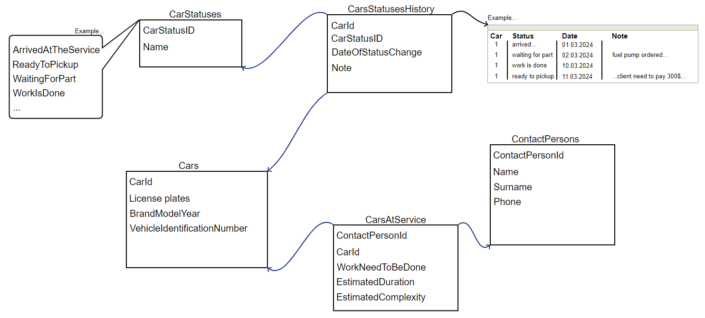

Short overview:
===============

What is this?
-------------

Very simple mechanic workshop Angular web application I created for the purpose of exercise. 
This Angular app fetches data from .NET Web API, but this API serves only as a backend mock, there is no DB (just in memory data), no authorization/authentication....

What is utilized?
-------------------

* Angular 17
* Angular Bootstrap
* Angular Component Store

How to run?
-----------

* Clone or download code

* Open backend solution (Visual studio 2019 or later) and run it

* Go to "AngularClient" folder and run "npm i" from console.

* Run "npm start" from console.

  
Data model
-----------

