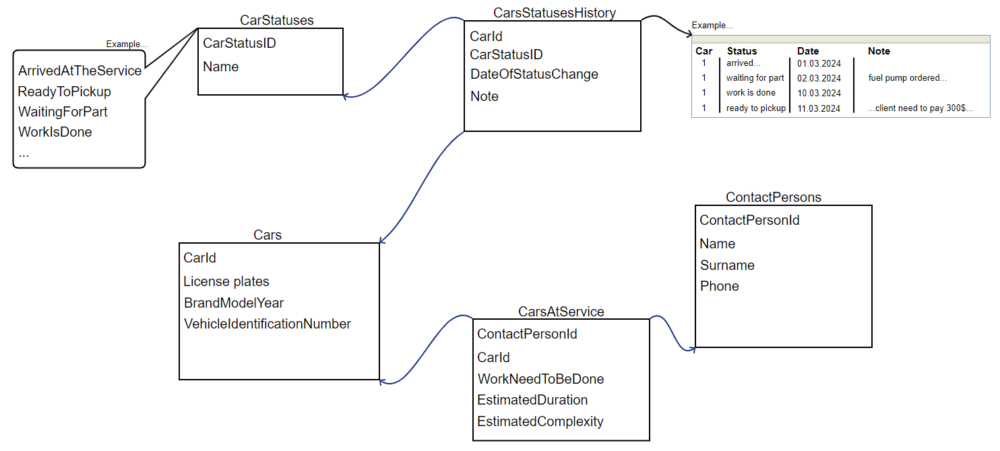
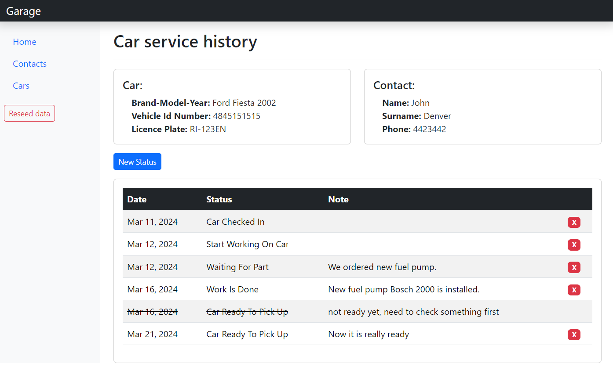
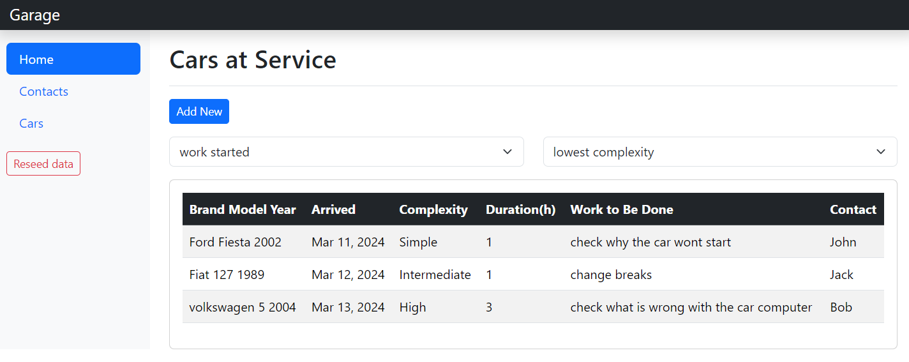
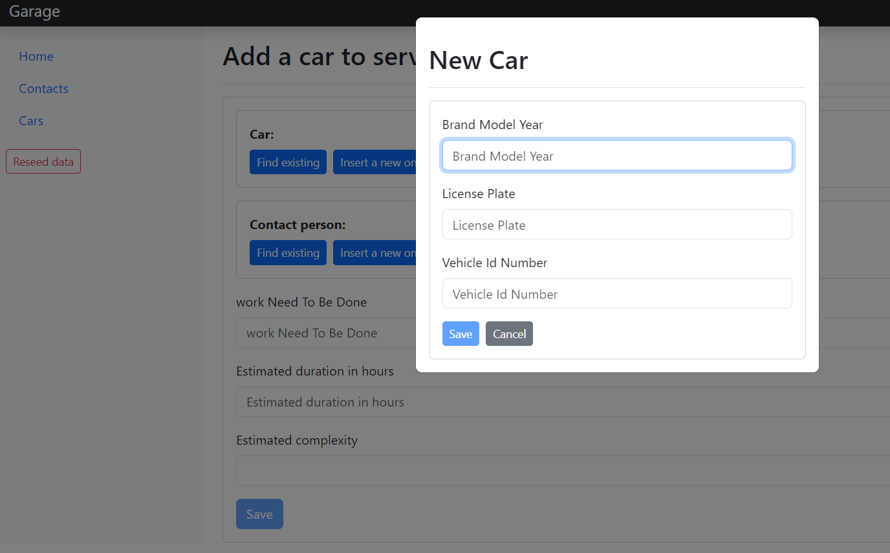

Short overview:
===============

What is this?
-------------

Very simple Mechanic Workshop Angular web application I created for the purpose of exercise. 
This Angular app fetches data from .NET Web API, but this API serves only as a backend mock, there is no DB (just in memory data), no authorization/authentication....

What is utilized?
-------------------

* Angular 17
* Angular Bootstrap
* Angular Component Store
* Reusable Components using @Input/@Output attributes to communicate between parent and child.
* Using "StandAlone" type of components instead of Angular modules.
* Using lazy loaded Angular components

How to run?
-----------

* Clone or download code
* Open backend solution (Visual studio 2022 or later) and run it
* Go to "AngularClient" folder and run "npm i" from console.
* Run "npm start" from console.

  
Data model
-----------

Some app screenshots
-----------

